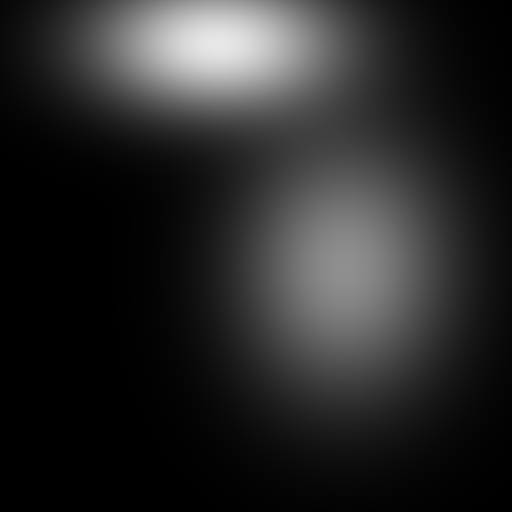
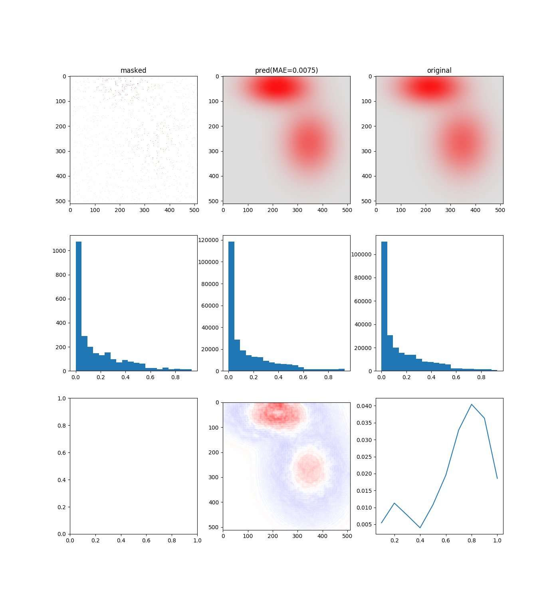

# PartialConvolution

## generateToyData.py
To generate ToyData, run this command.   
`python generateToyData.py`  
Then 1500 training images and 100 validation images, 100 test images (and each mask images) are generated.   
  
↓ToyData example↓  
  
  
Number of images are able to be changed by `-train` and `-valid`, `-test` option.  
For example `python generateToyData.py -train 5000 -valid 500 -test 500`  
  
If you want to get more details, use `-h` option.  
`python generateToyData.py -h`  

## main.py  
To start training, run this command. (xxxx is name of experiment)  
`python main.py xxxx`  
For example `python main.py hogehoge`.  
  
The following directory `experiment` is automatically created when you run this command.  
And the overall directory structure is as follows. (dataSet must be prepared by generateToyData.py or yourself)
```
PartialConvolution/
                 ┣ experiment/
                 ┃    ┗ hogehoge_logs
                 ┃        ┣ logs/
                 ┃        ┣ losses/
                 ┃        ┗ test_samples/
                 ┣ data/
                 ┃    ┗ dataSet/
                 ┃        ┣ train/
                 ┃        ┃   ┗ train_img/
                 ┃        ┣ train_mask/
                 ┃        ┣ test/
                 ┃        ┃   ┗ test_img/
                 ┃        ┣ test_mask/
                 ┃        ┣ valid/
                 ┃        ┃   ┗ valid_img/
                 ┃        ┗ valid_mask/
                 ┣ libs/
                 ┃    ┣ pconv_layer.py
                 ┃    ┣ pconv_model.py
                 ┃    ┗ util.py
                 ┣ main.py
                 ┣ test.py
                 ┗ generateToyData.py
```
  
To train normal PartialConvolution model, use `-KLoff` option.  
`python main.py xxxx -KLoff`  
  
If you want to get more details, use `-h` option.   
`python main.py -h`  
  
  
## test.py  
After training, run this command to test the model.  
`python test.py xxxx yyyy`  
xxxx is the name of experiment. yyyy is the name of the weight file to be loaded.  
For example
`python test.py KLPConv weights.100-0.13.h5`
  
The directory `result` is automatically created under `experiment` when you run this command.  
  
### /result/comparison
The directory `comparison` (under `result`) is contained some analysis.   
  
↓comparison example↓  
  
  
The top row is ordered from left to right: input, prediction, and ground truth.  
And the middle row is each histogram (Horizontal axis is pixel value and vertical axis is frequency).  
The middle of the bottom row shows deviation from the ground truth (positive values are red and negative values are blue).  
The right of the bottom row plots MAE of each pixel values (Horizontal axis is pixel value and vertical axis is MAE).  
  
If you want to get more details, use `-h` option.  
  
